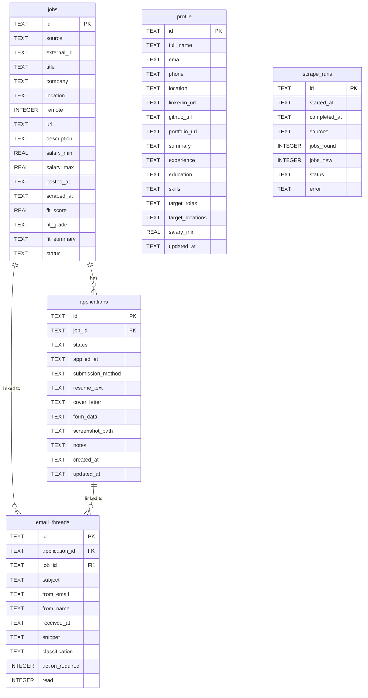

# Data Model — JobPilot

## Tables

### jobs

| Column | Type | Constraint | Notes |
|---|---|---|---|
| id | TEXT | PK | SHA-256 of `source:external_id` |
| source | TEXT | NOT NULL | greenhouse / lever / ashby / workday / custom |
| external_id | TEXT | NOT NULL | Platform's own job ID |
| title | TEXT | NOT NULL | Job title |
| company | TEXT | NOT NULL | Company name |
| location | TEXT | | Location string |
| remote | INTEGER | DEFAULT 0 | 0 or 1 |
| url | TEXT | NOT NULL UNIQUE | Application URL |
| description | TEXT | | Full JD text |
| salary_min | REAL | | Annualized USD |
| salary_max | REAL | | Annualized USD |
| posted_at | TEXT | | ISO 8601 |
| scraped_at | TEXT | NOT NULL | ISO 8601 |
| fit_score | REAL | | 0–100, Groq-generated |
| fit_grade | TEXT | | A / B / C / D / F |
| fit_summary | TEXT | | 1-sentence Groq justification |
| status | TEXT | DEFAULT 'new' | new / reviewed / queued / applied / archived |

UNIQUE constraint: `(source, external_id)` — dedup on re-scrape

### applications

| Column | Type | Constraint | Notes |
|---|---|---|---|
| id | TEXT | PK | UUID v4 |
| job_id | TEXT | FK → jobs.id CASCADE DELETE | |
| status | TEXT | DEFAULT 'draft' | See state machine below |
| applied_at | TEXT | | ISO 8601, set on submit |
| submission_method | TEXT | | form_fill / email / manual |
| resume_text | TEXT | | Tailored resume text |
| cover_letter | TEXT | | Cover letter text |
| form_data | TEXT | | JSON stringified field map |
| screenshot_path | TEXT | | Relative path under data/screenshots/ |
| notes | TEXT | | Free-form human notes |
| created_at | TEXT | NOT NULL | ISO 8601 |
| updated_at | TEXT | NOT NULL | ISO 8601, updated on every PATCH |

### profile

Singleton. Always one row with `id = 'default'`. Upserted via PUT /api/profile.

| Column | Type | Notes |
|---|---|---|
| id | TEXT PK | Always 'default' |
| full_name | TEXT | |
| email | TEXT | |
| phone | TEXT | |
| location | TEXT | |
| linkedin_url | TEXT | |
| github_url | TEXT | |
| portfolio_url | TEXT | |
| summary | TEXT | Professional summary |
| experience | TEXT | JSON array of ExperienceEntry |
| education | TEXT | JSON array of EducationEntry |
| skills | TEXT | JSON array of strings |
| target_roles | TEXT | JSON array of strings |
| target_locations | TEXT | JSON array of strings |
| salary_min | REAL | Walk-away number, annualized USD |
| updated_at | TEXT | ISO 8601 |

### email_threads

| Column | Type | Constraint | Notes |
|---|---|---|---|
| id | TEXT | PK | Gmail thread ID |
| application_id | TEXT | FK → applications.id | NULL if unmatched |
| job_id | TEXT | FK → jobs.id | NULL if unmatched |
| subject | TEXT | | Email subject line |
| from_email | TEXT | | Sender email |
| from_name | TEXT | | Sender display name |
| received_at | TEXT | NOT NULL | ISO 8601 |
| snippet | TEXT | | First ~200 chars of thread |
| classification | TEXT | DEFAULT 'other' | reply / rejection / interview / offer / other |
| action_required | INTEGER | DEFAULT 0 | 0 or 1 |
| read | INTEGER | DEFAULT 0 | 0 or 1 |

### scrape_runs

Append-only audit log. Never updated; new row per run.

| Column | Type | Constraint | Notes |
|---|---|---|---|
| id | TEXT | PK | UUID v4 |
| started_at | TEXT | NOT NULL | ISO 8601 |
| completed_at | TEXT | | NULL while running |
| sources | TEXT | | JSON array of sources attempted |
| jobs_found | INTEGER | DEFAULT 0 | Total rows returned by APIs |
| jobs_new | INTEGER | DEFAULT 0 | Net new after dedup |
| status | TEXT | DEFAULT 'running' | running / completed / failed |
| error | TEXT | | Error message or stack if failed |

---

## ER Diagram



---

## Application Status State Machine

```
                    ┌─────────────────────────────────────────────────┐
                    │                                                 │
draft ──► pending ──► submitted ──► replied ──► screen ──► interview ──► offer
              │              │                                            │
              ▼              ▼                                            ▼
          withdrawn       rejected                                   withdrawn
```

Valid transitions:

| From | To (allowed) |
|---|---|
| draft | pending, withdrawn |
| pending | submitted, withdrawn |
| submitted | replied, rejected |
| replied | screen, rejected |
| screen | interview, rejected |
| interview | offer, rejected |
| offer | withdrawn |
| rejected | (terminal) |
| withdrawn | (terminal) |

Enforced in: `PATCH /api/applications/[id]` — returns 400 if transition not in this table.

---

## Indexes

| Table | Index | Reason |
|---|---|---|
| jobs | (source, external_id) UNIQUE | Dedup on every scrape run |
| jobs | status | Filter by status on /jobs page |
| jobs | fit_score | Sort by score, filter by minScore |
| applications | job_id | Look up applications for a job |
| applications | status | Kanban column queries |
| email_threads | application_id | Link threads to applications |
| email_threads | received_at | Sort by date |

---

## SQLite Configuration

- WAL mode: enabled on startup (`PRAGMA journal_mode=WAL`)
- Reason: allows concurrent reads from Next.js routes while workers write
- DB file: `data/jobs.db` (gitignored)
- Migrations: managed by drizzle-kit, stored in `drizzle/migrations/`
- Schema changes: always via new migration, never manual edits to DB

---

## JSON Columns

These TEXT columns store JSON. Deserialized at the API layer before returning to clients. Never parsed inside the DB layer itself.

| Table | Column | Shape |
|---|---|---|
| profile | experience | ExperienceEntry[] |
| profile | education | EducationEntry[] |
| profile | skills | string[] |
| profile | target_roles | string[] |
| profile | target_locations | string[] |
| applications | form_data | Record<string, string> |
| scrape_runs | sources | string[] |
